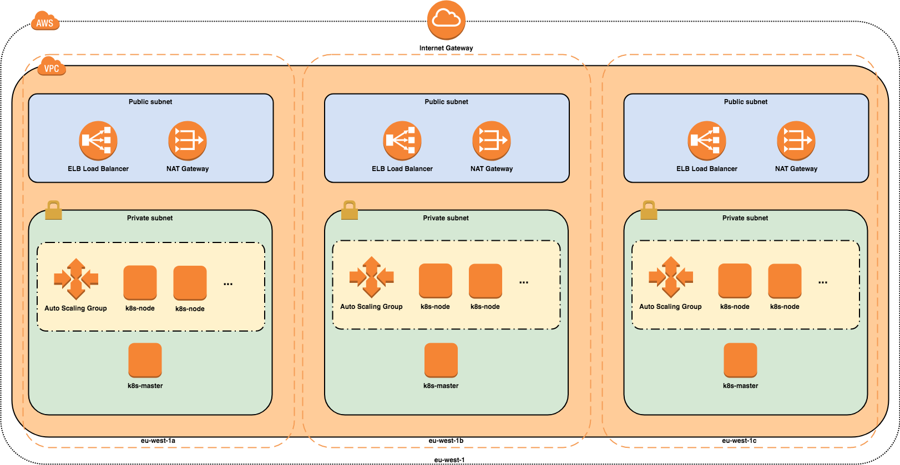

# Kubernetes Cluster Bootstrap

This project facilitates bootstrapping a new Kubernetes cluster on AWS.

This is an opinionated project, based on the following tools.

* [aws cli](https://aws.amazon.com/cli/) for interacting with AWS.

* [Terraform](https://www.terraform.io/) is used for creating AWS resources (apart from those
  created by kops).

* [kops](https://github.com/kubernetes/kops) is used for creating and managing the Kubernetes
  cluster.

* [kubectl](https://kubernetes.io/docs/tasks/tools/install-kubectl/) is the Kubernetes CLI, used for
  interacting with the cluster.

* [helm](https://helm.sh/) is used for deploying applications.

* [aws-iam-authenticator](https://github.com/kubernetes-sigs/aws-iam-authenticator) is used for
  authenticating to a Kubernetes cluster with AWS IAM credentials.

Everything is driven by [GNU make](https://www.gnu.org/software/make/).  The targets named
`deploy-<X>` are used to deploy each component; their corresponding `clean-<X>` target destroys that
component.


## Cluster architecture

This project creates a high-availability Kubernetes cluster in which the master and worker nodes are
spread across three availability zones (AZs) in a single region.  A new Virtual Private Cloud (VPC)
is created with both private and pubilc subnets in each AZ.  An Elastic Load-Balancer (ELB) provides
external access to the Kubernetes API server running on the master nodes.  All instances running
Kubernetes are created inside the private subnets, with outbound internet access provided by NAT and
Internet gateways.  A second ELB is created by the Kubernetes Ingress Controller to route incoming
traffic to applications running on the cluster.  The master nodes run in an Auto-Scaling Group (ASG)
of min and max size of 1.  This is to ensure that the nodes would be re-provisioned should the
underlying instance go down.  The worker nodes also run in an ASG, the size of which is
[configurable](kops/values.yaml).



## Pre-requisites

`docker`, `make`, `aws cli`, `terraform`, `kops`, `kubectl`, `helm` and `aws-iam-authenticator`
should be installed and available in the shell search path.  Refer to their respective documentation
for installation instructions specific to your OS.


## Getting started

The following steps will bring-up a new Kubernetes cluster.

1\. Configure AWS credentials

   Refer to the
   [AWS documentation](https://docs.aws.amazon.com/cli/latest/userguide/cli-chap-getting-started.html).
   The [Makefile](./Makefile) checks that the correct AWS environment (region and account) is
   configured for the environment.

   Also, create an IAM role, named `KubernetesAdmin`, that users must assume for successful interaction
   with the API Server.

   ```
   # get your account ID
   ACCOUNT_ID=$(aws sts get-caller-identity --output text --query 'Account')

   # define a role trust policy that opens the role to users in your account (limited by IAM policy)
   POLICY=$(echo -n '{"Version":"2012-10-17","Statement":[{"Effect":"Allow","Principal":{"AWS":"arn:aws:iam::'; echo -n "$ACCOUNT_ID"; echo -n ':root"},"Action":"sts:AssumeRole","Condition":{}}]}')

   # create a role named KubernetesAdmin (will print the new role's ARN)
   aws iam create-role \
     --role-name KubernetesAdmin \
     --description "Kubernetes administrator role (for AWS IAM Authenticator for Kubernetes)." \
     --assume-role-policy-document "$POLICY" \
     --output text \
     --query 'Role.Arn'
   ```

2\. `make deploy-bootstrap`

   Use this make target to create the Terraform local-state that is used to bootstrap Terraform
   itself. This includes creating the Terraform state bucket on S3 and creating a DynamoDb table
   used for to prevent concurrent deploys.  Terraform local state is used here to avoid the
   :chicken: and :egg: situation that Terraform requires some AWS resources to work. This step
   will create a terraform state file in the folder terraform/bootrap using the name
   ${ENVIRONMENT}-terraform.tfstate.

3\. `make deploy-infra`

   This make target deploys the infrastructure required by kops in order to create a Kubernetes
   cluster: an S3 bucket, in which to store the kops state; and, a Route53 hosted zone, delegated
   from a base zone, in which to register domain names used by the cluster.

4\. `make deploy-cluster`

   This target runs kops to create a new Kubernetes cluster.  This process takes time and, as
   indicated by the kops output, you need to wait until the cluster is up-and-running before
   proceeding to deploy applications.  Use the `validate-cluster` make target to determine whether
   a cluster is ready or not.

5\. `make validate-cluster`

   Simply runs `kops validate cluster` with the correct arguments for the state store.

6\. `make deploy-helm`

   Installs tiller (the helm agent) inside the Kubernetes cluster.  Ensure that the cluster is ready
   (by using the `validate-cluster` target above) before carrying out this step.

7\. `make deploy-authenticator`

   Packages and installs the AWS IAM Authenticator.  Ensure that Helm's tiller pod is running in the
   cluster before running this step.  This step can be re-run whenever you change the
   `configmap.yaml` containing the IAM user to Kubernetes user mapping.

8\. `make deploy-nginx-ingress`

   Creates an Ingress Controller, required for incoming traffic to reach applications running inside
   the cluster. We chose nginx as a simple Ingress Controller, but other brands are available. This
   step takes some time to complete in the background, as it creates both a Classic Elastic
   Load-Balancer on AWS.

9\. `make deploy-external-dns`

   Installs ExternalDNS which will take care of creating DNS A records for the exposed Kubernetes
   services and ingresses. ExternalDNS is installed with `sync` policy which means that it
   will do a full synchronization of DNS records. If you don't want ExternalDNS to delete any DNS
   records when you delete services or ingresses in the Kubernetes cluster, then change this value
   to `upsert-only`. See [extenal-dns](./docs/external-dns.md) for details.

10\. `make deploy-autoscaler`

   Deploys the [cluster autoscaler](https://github.com/kubernetes/autoscaler/tree/master/cluster-autoscaler)
   that automatically adjusts the size (within the limits specified in the
   [cluster spec](kops/cluster.tpl.yaml)) of the Kubenetes cluster based on resource needs.
   A good explanation on how the autoscaler works can be found in the
   [cluster autoscaler FAQ](https://github.com/kubernetes/autoscaler/blob/master/cluster-autoscaler/FAQ.md).

11\. `make deploy-app-echoserver`

   This make target packages a simple application into a helm chart and deploys that chart to the
   cluster. The echoserver application is a web-server that displays the HTTP headers of the
   received request. The URL at which the application can be reached can be seen with kubectl, via
   `kubectl get ingresses`. Though note that the wildcard DNS entry created in the previous step
   must have propagated through the DNS to the resolver on your local network before it will be
   reachable.


## Updating / upgrading the cluster

In kops terminology `updating` refers to changing cluster parameters such as the number or type of
virtual machines used for the instance groups; `upgrading` refers to upgrading the version of
Kubernetes running on the cluster.  Both of these procedures are, however, achieved in the same way.
When upgrading the Kubernetes version it's also necessary to check if the `cluster-autoscaler` needs
to be updated, since it is depending on the Kubernetes version, see [versions here](https://github.com/kubernetes/autoscaler/tree/master/cluster-autoscaler#releases).

When updating or upgrading the cluster take notice of deployments
that use a PodDisruptionBudget with `minAvailable` set to 1. nginx-ingress is such a deployment.
During the upgrade, Kubernetes is [not able](https://github.com/kubernetes/kops/issues/2537#issuecomment-399382465)
to drain nodes on which such Pods are running and the upgrade will hang until it times-out. The solution
is to use `kubectl` to manually delete the Pod, causing it to be re-scheduled to an alternative, available
node.

1\. Update the [values file](./kops/values.yaml)

2\. `make update-cluster`

## Tear-down

1\. `make clean-cluster`

   Destroys the Kubernetes cluster along with helm and any installed charts or applications.

2\. `make clean-infra`

   Removes the infrastructure required by kops.

3\. `make clean-bootstrap`

   Removes the infrastructure required by Terraform.

4\. `git clean -dfx`

   Always `git clean -dfx` before starting or after destroying a cluster (i.e. with
   `make clean-<X>`) to ensure that local Terraform state files (`bootstrap/*terraform.tfstate`) are
   removed.  Otherwise creating a new cluster with the same parameters may fail due to stale local
   state.


## Bastion

If you need to SSH into one of the master or nodes instances then you'll need to launch a bastion
host first. The Kubernetes cluster template defines a bastion instance group, however we set the
instance count to 0 so it's not enabled by default.

Do the following to launch a bastion host:

```
# edit the kops/values.yaml file, set bastionCount value to 1
$ make update-cluster
```

Once the bastion host is running, then run the following commands to SSH into the bastion host
with a forwarded SSH agent.

```
# if you don't have the private key on your machine, copy it from the kops state bucket
$ aws s3 cp s3://<kops-state-bucket>/ssh-key/<ssh-key> .

# verify you have an SSH agent running.
$ ssh-add -l

# if you need to add the private key to your agent
$ ssh-add path/to/private/key

# now you can SSH into the bastion
ssh -A admin@bastion.<cluster-fqdn>
```

Once successfully SSHed into the bastion host, you'll be able to SSH into any of the cluster master
or nodes instances by using their local IP address.

More details can be found here: https://github.com/kubernetes/kops/blob/master/docs/bastion.md

## Metrics

Memory and CPU utilisation metrics for both nodes and pods are available via Kubernetes'
[metrics pipeline](https://kubernetes.io/docs/tasks/debug-application-cluster/core-metrics-pipeline/).
This requires the Kubernetes Metrics Server be deployed in the cluster, which is done via the make
target `deploy-metrics-server`.  It is then possible to see information about either pods or nodes
with `kubectl top pods` or `kubectl top nodes` respectively.

## Customisation

The [Makefile](./Makefile) is parameterised.  The following parameters can be customised either by
overriding their value on the make command line or by exporting them in the shell.
Using [direnv](https://direnv.net/) can make this quite frictionless.

* `AWS_REGION`

  The AWS region in which common resources - such as Terraform and kops state storage buckets - are
  created.

* `BASE_FQDN`

  The domain name under which the cluster resources will be created.  A hosted-zone must already
  exist in Route 53 - in the same account - for this domain.

* `ENVIRONMENT`

  A name for the environment, such as `lab`, `dev`, `test`, `prod-eu`, `stage-sony-us` or even your name `john-does-cluster`, for a personal cluster.


Consult the [Makefile](./Makefile) for the default values.

The `ENVIRONMENT` parameter is used to separate clusters within the same account.

The [Makefile](./Makefile) validates known `ENVIRONMENT` values against particular
AWS account and region.  This is to protect against accidental deployment of infrastructure to the
wrong account or region.  Experience has shown that it is too easy to have production AWS
credentials (or profile) activated in the shell environment and to deploy the development
infrastructure or vice-versa.

To enable validation, put known environments and associated account ids and regions in a file called `environments.mk` as in the example below.

```
# Put two entries for each environment in this file using the convention
# <myenv>_aws_account=nnnn and <myenv>_aws_region=region

lab_aws_account=123456789
lab_aws_region=eu-west-2
```
You can also override ordinary environment variables such as `ENVIRONMENT` in this file to set your active environment.

As an example, to create a 'lab' cluster for individual experimentation the `ENVIRONMENT` parameter may be overridden when calling `make`:

```
$ make deploy-bootstrap ENVIRONMENT=lab
```

or, simply run `make deploy-bootstrap` if you have overridden `ENVIRONMENT` in the `environments.mk` file. Alternatively, if [direnv](https://direnv.net/) is installed as below.

```
$ cat .envrc
export AWS_PROFILE=lab
export AWS_REGION=eu-west-2
export BASE_FQDN=lab.sonymobile.com
export ENVIRONMENT=lab

$ direnv allow .
direnv: loading .envrc
direnv: export +AWS_PROFILE +AWS_REGION +BASE_FQDN +ENVIRONMENT
```

The individual values of the Kubernetes cluster spec used by kops can be customised for a particular
installation through the file kops/values-${ENVIRONMENT}.yaml. For example:

```
$ cat kops/values-lab.yaml
master:
  machineType: t2.medium
node:
  machineType: m5.large
  useSpotMarket: true
  maxPrice: 0.50
```

## Misc utilities

To set environment variables to get commands like `kops validate cluster` to work, just run:

```
$ $(make vars)
```

If you would like to manage a cluster that was not originally set up on your machine you can use
`make export-kubecfg` to create a kube context that lets you use `kubectl` towards that cluster. Be
sure to set the environment variables to match the target environment, i.e. ENVIRONMENT and
BASE_FQDN.
